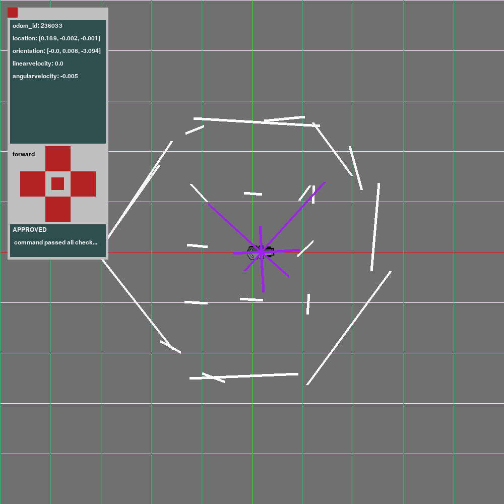

# rsb_py

## Structure

Conceptually there are three pieces here but all are incomplete. When they are more complete they probably would be two separate repos.

1. rsb_py: a thin python binding over the rsb redis interface. Makes no assumptions of what it will be used for. It's there simply to spare the user of the binding from having to learn redis in general.

1. rsb_script: a library that defines a programing model and object framework to write very simple scripts (without ROS) to make a robot do stuff.

## Current Status

1. rsb_py: simple and basically works. But will have to be extended to support new redis channels, and also, perhaps, to be made multi threaded and publish/subscribe based. This last bit would be needed only once we saw that we were having performance problems.

1. rsb_script: is a proof of concept, based on pygame. I can easily imagine it changing totally as we get more experience.

## Plan

### Goals 1

1. Familiarize Nate with the code
1. Shake down the rsb service some more
1. Set the stage for designing a better rsb script programing model

### List (not prioritized yet)

1. [DONE] Add a "control panel" next to the map window to include some basic readouts and commands for now, useful for further experimentation. Initially: readout of current odom and control for command_vel. Using that we can more easily see how things are working.

1. [DONE] Add a set if "rays" coming out of the robot to reflect the current /lidar bearings. They will end up looking like sensing whiskers and be longer or shorter to show the distance to the nearest obstacle.
    * 

    * The panel should be intuitive to use: odom info is printed in the top block, cmd controls are available in the middle, and cmd_feedback printout is at the bottom. Command feedback included both code and message, message gets shortened with (...) if it is too long. Buttons aren't labelled, but there is text next to the buttons that will display the name of the last pressed button. commands are sent to movement bridge, so rotating and moving are not possible at the same time. 
    * lidar rays project from the center of their "slice", not where they actually project from. sometimes lidar rays don't make sense - too short or too long. 
### Goals 2

1. Design a better rsb script programming model by using simple problems to validate

1. Create a rich demo of several rsbscript programs

### List

1. Roomba walk through space with obstacle
1. Wall Follow
1. Maze Solver

